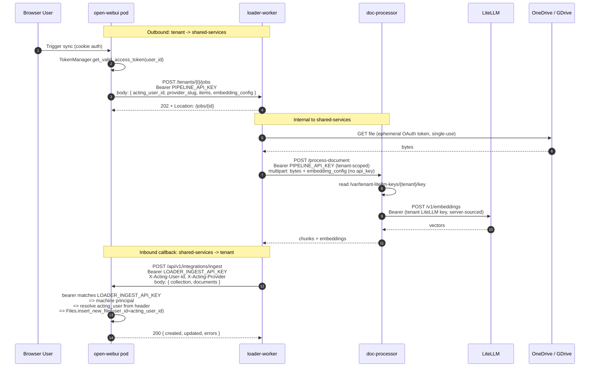
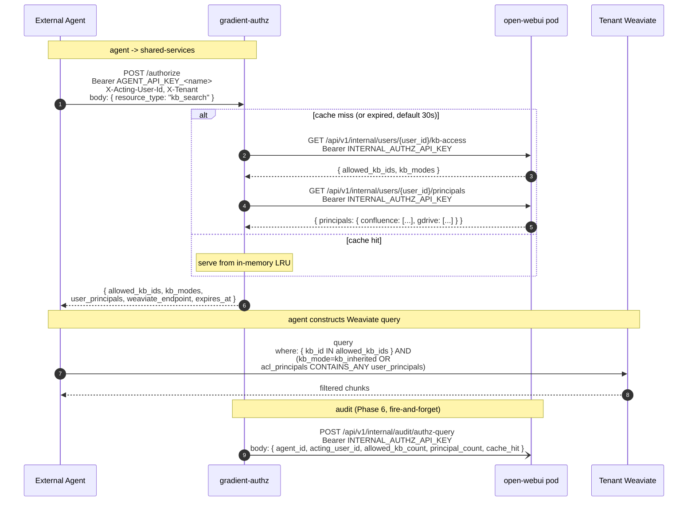

# Shared-Services Loader-Worker — Auth Layer

Companion diagram to `thoughts/shared/plans/2026-04-25-shared-services-loader-worker.md`.

## Bearer-key matrix

| Caller | Recipient | Bearer presented | Identity carried |
|---|---|---|---|
| Browser user | tenant `/ingest` | session cookie | `user.id` (UUID) from session, `provider` from `user.info` |
| Tenant pod | loader-worker `/jobs` | `PIPELINE_API_KEY` (per tenant) | `acting_user_id` (UUID), `provider_slug` in body |
| Loader-worker | doc-processor `/process-document` | `PIPELINE_API_KEY` (forwarded) | tenant slug from middleware |
| Loader-worker | tenant `/ingest` | `LOADER_INGEST_API_KEY` (per tenant) | `X-Acting-User-Id`, `X-Acting-Provider` headers |
| Doc-processor | LiteLLM `/embeddings` | tenant LiteLLM team key (sourced from `/var/tenant-litellm-keys/<tenant>/key`) | n/a |
| External agent | authz `/authorize` | `AGENT_API_KEY_<name>` (per agent, allow-listed) | `X-Acting-User-Id`, `X-Tenant` (Phase 5) |
| Authz service | open-webui internal endpoints | `INTERNAL_AUTHZ_API_KEY` (per tenant) | `user_id` in URL path (Phase 5) |
| External agent | tenant Weaviate (read-only) | per-tenant Weaviate read-only API key | filter constructed from authz response (Phase 5+6) |

## Sequence

## Sequence — Phase 5+6: External agent → authz service → Weaviate (query path)

See `2026-04-25-authz-service-query-path.png` for the rendered diagram.

## Key insight

The loader-worker is a **machine**, not a user. It proves "I am the loader" with `LOADER_INGEST_API_KEY`. The `user_id` for File ownership and the `provider_slug` for KB attribution come from the request — set by the tenant pod when it submits the job (it knows who triggered the sync), echoed back by the loader-worker on the callback.

Phase 5+6 generalizes the same pattern to the query path: `gradient-authz` is also a machine, presenting `INTERNAL_AUTHZ_API_KEY` to open-webui. The user_id is in the URL path (a query *about* a user, not a write *as* a user). External agents present `AGENT_API_KEY_<name>` to authz, with `X-Acting-User-Id` carrying the open-webui user identity. Open-webui remains the single source of truth for ACL state — authz is a caching relay.

This means:
- No DB service-account user to provision per tenant
- No admin-UI binding for a synthetic user
- No FK abuse — `Files.user_id` references a real human, the same one the in-pod sync uses today
- Existing `/ingest` cookie-auth path is untouched; the acting headers are simply ignored when a real session is present

Trade-off: a stolen `LOADER_INGEST_API_KEY` lets an attacker impersonate any `user_id` they know. That blast radius is no worse than today's "ingest arbitrary chunks to arbitrary KBs" with the same key.
